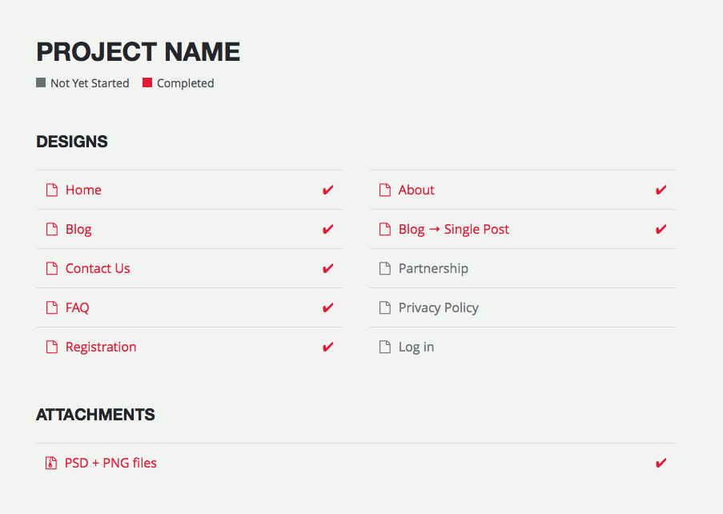

# Preview

Preview is simple PHP tool for showing web project to the client. Thanks to various types of content presentation, it can be also used to show preview of mobile designs in tablet or phone.



## Usage

To add or modify sections to index page, use `config.php` file located in root directory.

```php
<?php

return [
  'name' => 'Project Name',
  'sections' => [
    [
      'name' => 'Section Name',
      'layout' => 'columns',
      'items' => [
        [
          'name' => 'Item Name',
          'description' => '',
          'type' => 'file',
          'url' => '',
          'icon' => '',
          'class' => 'done',
        ],
      ],
    ],
  ],
];
```

## Options

There is number of options to configure look and content of index page.

### Global

<table>
  <thead>
    <tr>
      <th>Property</th>
      <th>Default</th>
      <th>Description</th>
    </tr>
  </thead>
  <tbody>
    <tr>
      <th scope="row"><code>name</code></th>
      <td><code>""</code></td>
      <td><code>String</code> Project name displayed at the top of index page.</td>
    </tr>
    <tr>
      <th scope="row"><code>sections</code></th>
      <td><code>[]</code></td>
      <td><code>Array</code> Array of sections containing items.</td>
    </tr>
  </tbody>
</table>

### Section

<table>
  <thead>
    <tr>
      <th>Property</th>
      <th>Default</th>
      <th>Description</th>
    </tr>
  </thead>
  <tbody>
    <tr>
      <th scope="row"><code>name</code></th>
      <td><code>""</code></td>
      <td><code>String</code> Name of the section.</td>
    </tr>
    <tr>
      <th scope="row"><code>description</code></th>
      <td><code>""</code></td>
      <td><code>String</code> Optional description for the item.</td>
    </tr>
    <tr>
      <th scope="row"><code>layout</code></th>
      <td><code>"single"</code></td>
      <td><code>String</code> Accepts: `"single"` or `"split"`. Split layout shows two columns with items instead of one.</td>
    </tr>
    <tr>
      <th scope="row"><code>items</code></th>
      <td><code>[]</code></td>
      <td><code>Array</code> Array of items in section.</td>
    </tr>
  </tbody>
</table>

### Item

<table>
  <thead>
    <tr>
      <th>Property</th>
      <th>Default</th>
      <th>Description</th>
    </tr>
  </thead>
  <tbody>
    <tr>
      <th scope="row"><code>name</code></th>
      <td><code>""</code></td>
      <td><code>String</code> Name of the item.</td>
    </tr>
    <tr>
      <th scope="row"><code>type</code></th>
      <td><code>"link"</code></td>
      <td><code>String</code> Accepts: `"link"`,  `"tablet"`,  `"iphone"` or `"design"`.</td>
    </tr>
    <tr>
      <th scope="row"><code>url</code></th>
      <td><code>""</code></td>
      <td><code>String</code> Link or relative path to the resouce.</td>
    </tr>
    <tr>
      <th scope="row"><code>icon</code></th>
      <td><code>"file-o"</code></td>
      <td><code>String</code> Name of one of [Font Awesome](http://fontawesome.io/icons/) icons (should be entered without `fa-` prefix). If `false`, icon is not displayed at all.</td>
    </tr>
    <tr>
      <th scope="row"><code>class</code></th>
      <td><code>""</code></td>
      <td><code>String</code> CSS class added to item. Available classes: `"done"` (only this one for now).</td>
    </tr>
  </tbody>
</table>

## Example configuration

Below is example config.php file. The same data was used in listing showed at the top of `readme.md`.

```php
<?php

return [
  'name' => 'Project Name',
  'sections' => [
    [
      'name' => 'Designs',
      'layout' => 'split',
      'items' => [
        [
          'name' => 'Home',
          'link' => '#',
          'type' => 'phone',
          'class' => 'done',
        ],
        [
          'name' => 'About',
          'link' => '#',
          'type' => 'phone',
          'class' => 'done',
        ],
        [
          'name' => 'Blog',
          'link' => '#',
          'type' => 'phone',
          'class' => 'done',
        ],
        [
          'name' => 'Blog &rarr; Single Post',
          'link' => '#',
          'type' => 'phone',
          'class' => 'done',
        ],
        [
          'name' => 'Contact Us',
          'link' => '#',
          'type' => 'phone',
          'class' => 'done',
        ],
        [
          'name' => 'Partnership',
          'link' => '#',
          'type' => 'phone',
          'class' => '',
        ],
        [
          'name' => 'FAQ',
          'link' => '#',
          'type' => 'phone',
          'class' => 'done',
        ],
        [
          'name' => 'Privacy Policy',
          'link' => '#',
          'type' => 'phone',
          'class' => '',
        ],
        [
          'name' => 'Registration',
          'link' => '#',
          'type' => 'phone',
          'class' => 'done',
        ],
        [
          'name' => 'Log in',
          'link' => '#',
          'type' => 'phone',
          'class' => '',
        ],
      ],
    ],

    // Attachments
    [
      'name' => 'Attachments',
      'items' => [
        [
          'name' => 'PSD + PNG files',
          'link' => '#',
          'type' => 'file',
          'icon' => 'file-zip-o',
          'class' => 'done',
        ],
      ],
    ],
  ],
];
```

## Changes in styling

Sass is used to generate CSS style. If you want to modify styling of or add new device, run below command to watch for changes in `main.scss` file.

```
sass main.scss:main.css --style compressed
```

## License

Preview is licensed under MIT License.
